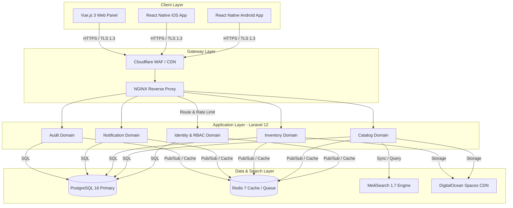
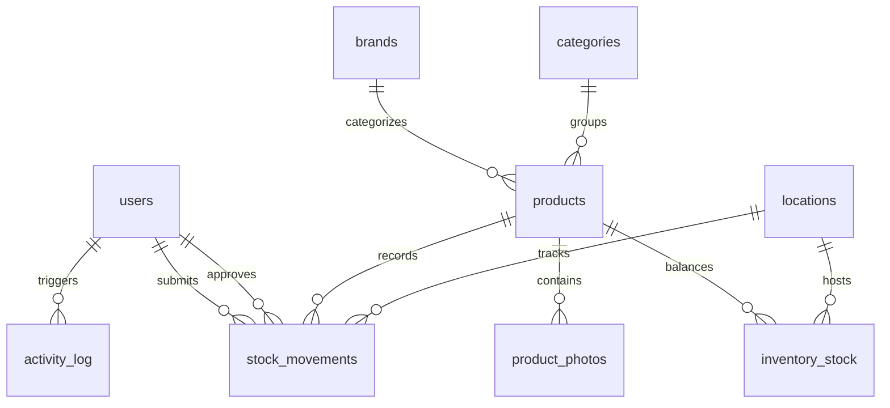
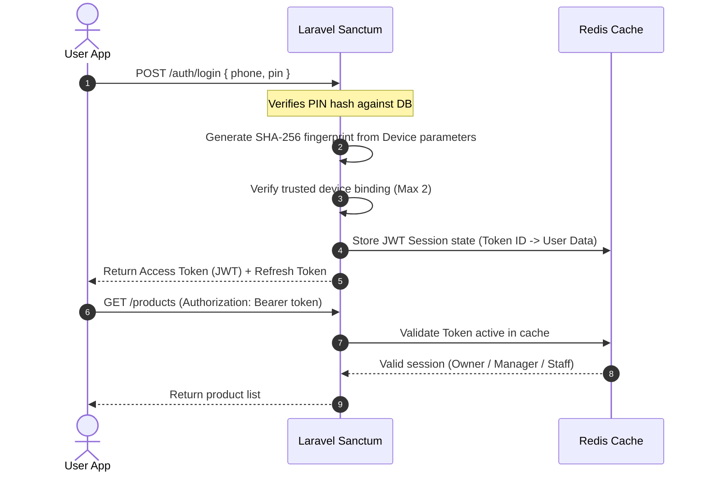
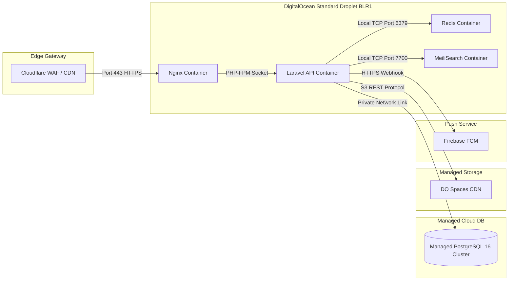

# Technical Layer Spec: Garg Enterprises Phase 1

This document outlines the Technical Layer for Phase 1 of the Garg Enterprises Inventory Management System. It specifies the architecture, data structures, integration patterns, security constraints, and deployment topologies required for implementation.

---

## 1. System Architecture

The system utilizes an API-first, mobile-native, offline-capable architecture. A single Laravel 12 API serves both the React Native mobile app and the Vue.js Owner web panel. The backend is designed as a modular monolith using Domain-Driven Design (DDD) principles.



### Domain Boundaries
1. **Identity & RBAC Domain**: Handles device-bound JWT authentication, role resolution (Owner, Manager, Staff, Godown), PIN verification, and session management.
2. **Catalog Domain**: Manages products, categories (hierarchical), brands, locations, barcode lookups, and bulk Excel import queues.
3. **Inventory Domain**: Coordinates live stock levels, transaction state transitions (Maker-Checker workflow), cycle count audits, and variance reports.
4. **Notification Domain**: Dispatches transactional alerts via Firebase Cloud Messaging (FCM) and manages user alert mailboxes.
5. **Audit Domain**: Writes immutable system mutations to append-only logs.

---

## 2. Tech Stack

The selected technologies prioritize offline data speed, fast search lookups, robust data transactions, and simple deployment footprints.

| Component | Technology | Version | Rationale |
| :--- | :--- | :--- | :--- |
| **Mobile App Framework** | React Native (Expo Bare) | 0.74+ | Single codebase for Android + iOS; native camera access; works with local SQLite. |
| **Mobile Local DB** | WatermelonDB | 0.27+ | SQLite-backed reactive engine; handles 100K+ records with lazy loading on 2GB RAM. |
| **Backend Framework** | Laravel (PHP) | 12.x | Domain routing; native policy-based RBAC; job queue management; fast development speed. |
| **Primary Database** | PostgreSQL | 16.x | ACID compliance; JSONB support; native LTREE extension for hierarchical category trees. |
| **Search Engine** | MeiliSearch | 1.7+ | Open-source, self-hosted search; typo-tolerant; sub-50ms engine search queries. |
| **Cache & Queue** | Redis | 7.x | High-throughput storage for user sessions, rate limits, and asynchronous background import workers. |
| **Web Panel Framework** | Vue.js 3 / Inertia.js | 3.4 | Single Page Application (SPA) dashboard sharing backend controllers without duplicate API layer. |
| **Cloud Hosting** | DigitalOcean | BLR1 | Bangalore data center (~40ms latency to Ludhiana); managed DB cluster; predictable monthly billing. |
| **Object Storage** | DigitalOcean Spaces | 250GB | S3-compatible storage for product media assets and generated spreadsheet report files. |
| **Push Notifications** | Firebase FCM | Latest | Cross-platform delivery; reliable background wake-ups for critical owner actions. |

---

## 3. API Conventions

### Base Protocol
* **Base URL**: `https://api.gargenterprises.in/v1/`
* **Transport**: HTTPS strictly enforced, requiring TLS 1.3.
* **Headers**:
  * `Accept: application/json`
  * `Content-Type: application/json`
  * `Authorization: Bearer {JWT_TOKEN}`

### Standard Response Envelope
```json
{
  "success": true,
  "data": {},
  "meta": {
    "timestamp": "2026-05-28T08:10:00Z"
  }
}
```

### Standard Error Envelope
```json
{
  "success": false,
  "error": {
    "code": "INSUFFICIENT_STOCK",
    "message": "The requested outward quantity exceeds stock available at this location.",
    "details": {
      "product_id": 14022,
      "location_id": 412,
      "qty_requested": 15.0,
      "qty_available": 4.0
    }
  },
  "meta": {
    "timestamp": "2026-05-28T08:10:01Z"
  }
}
```

### Route-Level Rate Limiting
* Enforced via Redis sliding-window counter.
* Standard limit: **200 requests/token/minute**.
* Endpoint-specific limits (e.g., `/auth/login`): **5 attempts/phone/15 minutes**.

---

## 4. Database Schema

The database schema utilizes standard third-normal-form mappings, optimized with specialized indexes and LTREE structures for speedy tree traversals.



### DDL Schema Definitions

```sql
-- PostgreSQL 16
CREATE EXTENSION IF NOT EXISTS ltree;

-- 1. Brands Table
CREATE TABLE brands (
    id BIGSERIAL PRIMARY KEY,
    name VARCHAR(100) NOT NULL,
    slug VARCHAR(100) NOT NULL UNIQUE,
    logo_url TEXT,
    is_authorised BOOLEAN NOT NULL DEFAULT FALSE,
    created_at TIMESTAMPTZ NOT NULL DEFAULT NOW(),
    updated_at TIMESTAMPTZ NOT NULL DEFAULT NOW()
);
CREATE INDEX idx_brands_slug ON brands(slug);

-- 2. Categories Table (Hierarchical Tree using LTREE)
CREATE TABLE categories (
    id BIGSERIAL PRIMARY KEY,
    parent_id BIGINT REFERENCES categories(id) ON DELETE SET NULL,
    name VARCHAR(150) NOT NULL,
    slug VARCHAR(150) NOT NULL UNIQUE,
    level SMALLINT NOT NULL CHECK (level BETWEEN 1 AND 4),
    path ltree NOT NULL,
    sort_order INT NOT NULL DEFAULT 0,
    created_at TIMESTAMPTZ NOT NULL DEFAULT NOW()
);
CREATE INDEX idx_categories_path ON categories USING gist(path);
CREATE INDEX idx_categories_parent ON categories(parent_id);

-- 3. Locations Table (Floor, Section, Aisle, Bin)
CREATE TABLE locations (
    id BIGSERIAL PRIMARY KEY,
    parent_id BIGINT REFERENCES locations(id) ON DELETE SET NULL,
    name VARCHAR(100) NOT NULL,
    code VARCHAR(30) NOT NULL UNIQUE,
    type VARCHAR(20) NOT NULL CHECK (type IN ('floor', 'section', 'aisle', 'bin')),
    capacity_units INT,
    is_active BOOLEAN NOT NULL DEFAULT TRUE,
    created_at TIMESTAMPTZ NOT NULL DEFAULT NOW()
);
CREATE INDEX idx_locations_parent_type ON locations(parent_id, type);

-- 4. Products Table (Master SKU List)
CREATE TABLE products (
    id BIGSERIAL PRIMARY KEY,
    sku_code VARCHAR(50) NOT NULL UNIQUE,
    barcode VARCHAR(100) UNIQUE,
    product_name VARCHAR(255) NOT NULL,
    brand_id BIGINT NOT NULL REFERENCES brands(id) ON DELETE RESTRICT,
    category_id BIGINT NOT NULL REFERENCES categories(id) ON DELETE RESTRICT,
    uom_base VARCHAR(20) NOT NULL DEFAULT 'pcs',
    uom_conversion NUMERIC(10,4) NOT NULL DEFAULT 1.0000,
    reorder_point NUMERIC(12,4) NOT NULL DEFAULT 0.0000,
    hsn_code VARCHAR(20),
    metadata JSONB,
    status VARCHAR(20) NOT NULL DEFAULT 'active' CHECK (status IN ('active', 'inactive')),
    created_at TIMESTAMPTZ NOT NULL DEFAULT NOW(),
    updated_at TIMESTAMPTZ NOT NULL DEFAULT NOW()
);
CREATE INDEX idx_products_brand_cat ON products(brand_id, category_id);
CREATE INDEX idx_products_barcode ON products(barcode) WHERE barcode IS NOT NULL;
CREATE INDEX idx_products_metadata ON products USING gin(metadata);

-- 5. Inventory Stock Table
CREATE TABLE inventory_stock (
    product_id BIGINT NOT NULL REFERENCES products(id) ON DELETE RESTRICT,
    location_id BIGINT NOT NULL REFERENCES locations(id) ON DELETE RESTRICT,
    qty_on_hand NUMERIC(12,4) NOT NULL DEFAULT 0.0000,
    qty_reserved NUMERIC(12,4) NOT NULL DEFAULT 0.0000,
    status_flag VARCHAR(20) NOT NULL DEFAULT 'in_stock' CHECK (status_flag IN ('in_stock', 'low_stock', 'out_of_stock', 'excess_stock', 'dead_stock', 'out_of_trend')),
    last_movement_at TIMESTAMPTZ NOT NULL DEFAULT NOW(),
    PRIMARY KEY (product_id, location_id)
);
CREATE INDEX idx_inventory_alerts ON inventory_stock(qty_on_hand, status_flag);

-- 6. Users Table
CREATE TABLE users (
    id BIGSERIAL PRIMARY KEY,
    name VARCHAR(150) NOT NULL,
    phone VARCHAR(20) NOT NULL UNIQUE,
    pin_hash VARCHAR(255) NOT NULL,
    role VARCHAR(20) NOT NULL CHECK (role IN ('owner', 'manager', 'staff', 'godown')),
    device_ids JSONB NOT NULL DEFAULT '[]'::jsonb,
    status VARCHAR(20) NOT NULL DEFAULT 'active' CHECK (status IN ('active', 'inactive')),
    created_at TIMESTAMPTZ NOT NULL DEFAULT NOW()
);

-- 7. Stock Movements (Maker-Checker Core)
CREATE TABLE stock_movements (
    id BIGSERIAL PRIMARY KEY,
    product_id BIGINT NOT NULL REFERENCES products(id) ON DELETE RESTRICT,
    from_location_id BIGINT REFERENCES locations(id) ON DELETE RESTRICT,
    to_location_id BIGINT REFERENCES locations(id) ON DELETE RESTRICT,
    qty NUMERIC(12,4) NOT NULL CHECK (qty > 0),
    movement_type VARCHAR(20) NOT NULL CHECK (movement_type IN ('inward', 'outward', 'transfer', 'write_off', 'reserve', 'release')),
    status VARCHAR(20) NOT NULL DEFAULT 'pending' CHECK (status IN ('pending', 'approved', 'rejected')),
    submitted_by BIGINT NOT NULL REFERENCES users(id),
    approved_by BIGINT REFERENCES users(id),
    photo_url TEXT,
    rejection_reason VARCHAR(255),
    submitted_at TIMESTAMPTZ NOT NULL DEFAULT NOW(),
    processed_at TIMESTAMPTZ
);
CREATE INDEX idx_movements_status_time ON stock_movements(status, submitted_at DESC);
CREATE INDEX idx_movements_product_time ON stock_movements(product_id, submitted_at DESC);

-- 8. Activity Log (Immutable Audit Log)
CREATE TABLE activity_log (
    id BIGSERIAL PRIMARY KEY,
    user_id BIGINT REFERENCES users(id) ON DELETE SET NULL,
    action VARCHAR(100) NOT NULL,
    entity_type VARCHAR(50) NOT NULL,
    entity_id BIGINT NOT NULL,
    old_value JSONB,
    new_value JSONB,
    created_at TIMESTAMPTZ NOT NULL DEFAULT NOW()
);
CREATE INDEX idx_audit_user_time ON activity_log(user_id, created_at DESC);
CREATE INDEX idx_audit_entity ON activity_log(entity_type, entity_id);

-- Restrict mutations on Activity Log
REVOKE UPDATE, DELETE ON activity_log FROM PUBLIC;
```

---

## 5. Authentication Model

### Protocol Workflow


### Session Lifecycle Settings
* **Access Token (JWT)**:
  * Owner role: **24 hours** lifetime.
  * All other roles: **10 hours** lifetime.
* **Refresh Token**: **30 days** lifetime.
* **Biometric Renewal**:
  * Allows re-generating access tokens using local iOS KeyChain/Android Keystore biometric validation signature without requiring a PIN re-entry if the session is active.
* **PIN Bruteforce Security**:
  * 5 consecutive invalid PIN entries lock the user account inside Redis for **30 minutes**.
  * The owner receives a push alert immediately.

---

## 6. Security Requirements

### Cryptographic Safeguards
* **Data-in-Transit**: TLS 1.3 enforced. All ports except HTTPS (443) are blocked at the firewall.
* **Data-at-Rest**: DigitalOcean Managed Database volumes encrypted with AES-256.
* **PIN Storage**: Pin stored using **bcrypt** (rounds = 10). Placed as a 6-digit integer block.

### Client-Side App Protections
* **Root Detection**: App incorporates native check libraries (RootBeer for Android, DTTJailbreakDetection for iOS). The app will automatically crash/close if root or jailbreak status is active.
* **In-App Auto-Lock**: Mobile app monitors user touch events. If no interaction is captured for 5 minutes, the active screen transitions to a biometric/PIN unlock overlay.
* **Device Fingerprinting**: Hardware fingerprint generated from `Brand + Model + OS Version + AndroidID/IFA` hashed with a server-side salt. Device identifier binds to token.

### Data Integrity Rules
* **Append-Only Auditing**: The database user account granted to the API backend is explicitly denied `UPDATE` and `DELETE` privileges on the `activity_log` table.
* **Transaction Atomic Wrappers**: Every inventory balance mutation must execute within a standard database transaction context using the `SERIALIZABLE` isolation level or explicit row locking:
  ```sql
  BEGIN;
  SELECT qty_on_hand FROM inventory_stock WHERE product_id = X AND location_id = Y FOR UPDATE;
  -- Calculate new qty
  UPDATE inventory_stock SET qty_on_hand = NEW_QTY WHERE product_id = X AND location_id = Y;
  INSERT INTO stock_movements (product_id, qty, movement_type, ...) VALUES (...);
  COMMIT;
  ```

---

## 7. Infrastructure Requirements

### DigitalOcean Deployment Setup (Bangalore Region - BLR1)

#### Droplet Specification (App + Search + Cache Host)
* **Instance Size**: Standard General Purpose Droplet.
* **Specs**: **4 vCPUs / 8 GB RAM / 50 GB SSD**.
* **Role**: Runs Dockerized Nginx, Laravel API PHP-FPM workers, Redis cluster, and MeiliSearch engine.

#### Managed PostgreSQL Database Cluster
* **Instance Size**: Standard Managed DB Cluster.
* **Specs**: **2 vCPUs / 4 GB RAM / 30 GB SSD** (Single Node for Phase 1; Read-Replica added in Phase 2).
* **Backups**: Standard 7-day rolling automated recovery snapshots.

#### Object Storage (DO Spaces)
* **Size**: 250 GB baseline.
* **Role**: Storage for product images and downloadable Excel logs.

### Monthly Budget Projection
* **DO Droplet (4vCPU / 8GB)**: ₹5,600/month
* **Managed Database (2vCPU / 4GB)**: ₹2,600/month
* **Spaces Storage (250GB)**: ₹430/month
* **Automated Daily Backups**: ₹480/month
* **Total Dedicated Cloud Infrastructure**: **₹9,110 / month** (plus GST).

---

## 8. Performance Targets & SLAs

To ensure a smooth user experience, the system must meet these technical performance thresholds:

* **Barcode Scan Lookup (Online)**: `< 300ms` E2E response time.
* **Barcode Scan Lookup (Offline)**: `< 150ms` local SQLite query time.
* **Full-Text Catalog Search (26K SKUs)**: `< 800ms` E2E E-commerce search latency (MeiliSearch engine query execution target `< 50ms`).
* **Category Tree Retrieval**: `< 400ms` (cached via Redis memory).
* **Live Stock Count Balance View**: `< 800ms` E2E.
* **Maker-Checker Submission**: `< 500ms` response to client (FCM notification runs asynchronously).
* **Excel Bulk Import (26K SKUs)**: `< 3 minutes` total import time via Laravel Queue batches.
* **MeiliSearch Sync Delay**: `< 5 seconds` indexing latency after product modification.
* **Mobile App Cold Boot Time**: `< 3 seconds` to fully interactive state on standard Android devices with 3GB RAM.
* **System Availability SLA**: `99.5%` uptime per month.

---

## 9. Deployment Topology

The system uses a simple, resilient Dockerized footprint behind a Cloudflare edge gateway to minimize operational complexity.



### Production Rollout Workflow
1. **GitHub Trigger**: Developer pushes code to `main` branch.
2. **CI Pipeline (GitHub Actions)**:
   * Installs dependencies and lint-checks code.
   * Runs PHPUnit test assertions.
   * Compiles mobile app bundle check.
3. **CD Pipeline**:
   * Pulls new Docker images to target droplet.
   * Runs database migrations: `php artisan migrate --force`.
   * Clears app cache: `php artisan route:cache`, `php artisan config:cache`.
   * Hot-reloads Nginx proxies.
